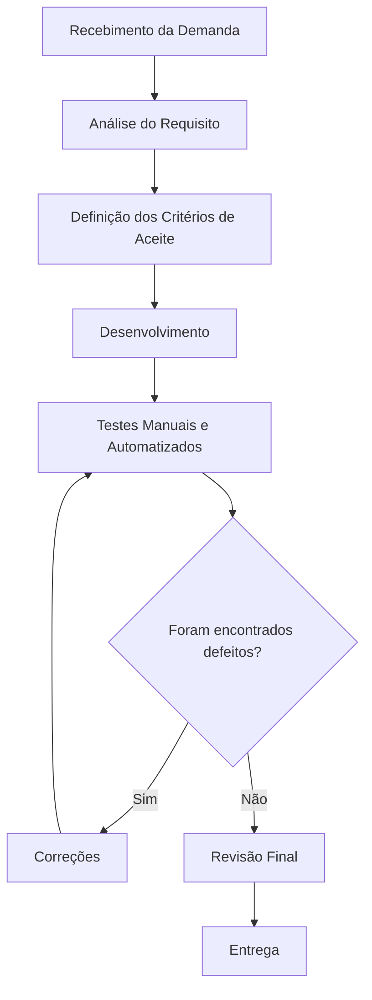

# Aula 14 - Qualidade de Processo

## Integrantes

- Lucas Fernandes da Silva
- Henrique Laroque
- Adriel Martins
- Derick Laroque

## 1. Mapeamento do Processo

### Fluxo Atual da Equipe

O fluxo atual da equipe para desenvolvimento e validação de funcionalidades do LocalEats pode ser representado da seguinte forma:

```text
Recebimento da Demanda
          ↓
 Análise do Requisito
          ↓
Definição dos Critérios de Aceite
          ↓
   Desenvolvimento
          ↓
 Testes Manuais e Automatizados
          ↓
     Correções
          ↓
   Revisão Final
          ↓
       Entrega
```

Também é possível representar esse fluxo em Mermaid:



Esse processo mostra uma sequência mais completa, pois inclui a análise do requisito e a definição dos critérios de aceite antes do desenvolvimento. Dessa forma, a equipe consegue validar melhor o que precisa ser feito antes de começar a implementação.

## 2. Entradas, Atividades e Saídas

| Etapa | Entrada | Atividade | Saída |
|---|---|---|---|
| Recebimento da demanda | Solicitação, necessidade do usuário ou requisito inicial | Registrar e entender a demanda recebida | Demanda registrada |
| Análise do requisito | Demanda registrada | Avaliar regra de negócio, impacto no sistema e dúvidas da equipe | Requisito compreendido |
| Definição dos critérios de aceite | Requisito compreendido | Definir o que precisa ser validado para considerar a tarefa concluída | Critérios de aceite definidos |
| Desenvolvimento | Requisito e critérios de aceite | Implementar a funcionalidade ou ajuste no sistema | Código desenvolvido |
| Testes manuais e automatizados | Código desenvolvido | Executar validações, testes manuais e testes automatizados quando aplicável | Evidências de teste e possíveis defeitos |
| Correções | Defeitos encontrados | Ajustar o código e corrigir os problemas identificados | Nova versão corrigida |
| Revisão final | Versão corrigida e evidências de teste | Conferir se a entrega atende aos critérios de aceite | Funcionalidade aprovada |
| Entrega | Funcionalidade aprovada | Publicar, enviar ou disponibilizar a alteração no repositório | Funcionalidade entregue |

## 3. Reflexão sobre o Processo

### 1. O processo utilizado pela equipe está claramente definido?

Parcialmente. A equipe segue etapas conhecidas, como recebimento da demanda, análise do requisito, desenvolvimento, testes, correções, revisão final e entrega. Porém, nem sempre essas etapas estão documentadas de forma detalhada. Isso pode fazer com que algumas decisões sejam tomadas de maneira diferente por cada integrante.

### 2. Todos os integrantes seguem o mesmo fluxo de trabalho?

Na maior parte do tempo sim, porém algumas atividades podem ser realizadas de forma diferente entre os integrantes. Por exemplo, um integrante pode iniciar o desenvolvimento logo após receber a demanda, enquanto outro pode primeiro definir critérios de aceite ou validar melhor o requisito. A padronização do fluxo ajudaria todos a trabalharem de forma mais alinhada.

### 3. Em quais etapas a qualidade é verificada?

A qualidade é verificada em várias etapas do processo. Na análise do requisito, a equipe verifica se entendeu corretamente a demanda. Na definição dos critérios de aceite, define o que precisa ser validado. Durante os testes manuais e automatizados, são identificados defeitos. Nas correções, os problemas encontrados são ajustados. Na revisão final, a equipe confirma se a funcionalidade está pronta para entrega.

### 4. Quais melhorias poderiam tornar o processo mais eficiente?

- Padronizar o fluxo de trabalho da equipe.
- Utilizar checklist de validação antes da entrega.
- Aumentar a automação dos testes.
- Registrar melhor as evidências dos testes realizados.
- Definir critérios de aceitação antes do desenvolvimento.
- Realizar uma revisão final antes de considerar a funcionalidade entregue.

### 5. Como a qualidade do processo impacta a qualidade do produto final?

Um processo organizado reduz erros, retrabalho e aumenta a confiabilidade do software entregue. Quando a equipe analisa bem o requisito, define critérios de aceite, testa com consistência e faz uma revisão final, os problemas tendem a ser encontrados mais cedo. Isso melhora a qualidade do LocalEats, pois diminui a chance de defeitos chegarem ao usuário final.
